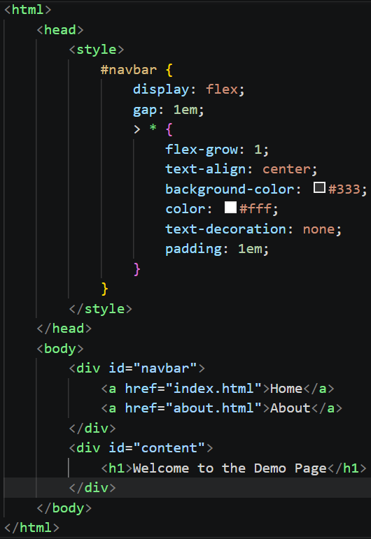

# Flex and Grid

* Use flex and grid layouts so that you can create responsive designs.

## Predict & Run

* Sketch what you think the snippet will achieve.
*Show your answer to your neighbour*
* Type it into an `.html` file, were you right?
*Your answer here*

## Inspect & Debug

* Toggle rules on and off using the debugging tools.
* Explain what each flex rules does.
*Your answer here*

---

## Adapt & Modify

* Go to [CSS Tricks](https://css-tricks.com/snippets/css/a-guide-to-flexbox/) and try some of the other flex based rules.
* Describe one of the rules you tried.
*Your answer here*

---

## Grid

* Flex is great where you have T junctions, either horizontal or vertical.
* However, sometimes you want both horizontal and vertical alignment...
* [Grid!](https://css-tricks.com/complete-guide-css-grid-layout/)

---

## Make

* Use these rules to achieve a menu bar in your project.
