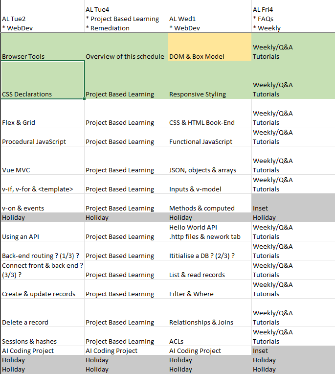

# HTML & CSS wrap-up

* Describe a CSS rule so that your learning becomes more independent.

## Do Now

* Put together a demo of a CSS rule.
* Use inspect to untick and tick the rule.
*Show it to your neighbour. Explain the difference the rule makes.*

---

## Hand-over

This should be the last lesson where I am teaching you how to layout, present and style websites.
I've covered the major styles, selectors, syntax and research resources.
You will continue to discover, explore, ask and work these out during your project work.
My main teaching focus will be on how you make websites interactive.

---

## Showcase

1. If you were born in January, April, July or October, be ready to show your example.
1. Everyone else go visiting!
1. If you were born in February, May, August or November, be ready to show your example.
1. Everyone else go visiting!
1. If you were born in March, June, September or December, be ready to show your example.
1. Everyone else go visiting!
