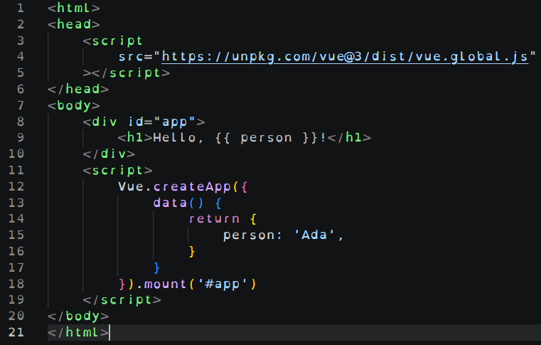

# Vue MVC

* Integrate data elements into your web development so that you can cause a page to update dynamically.

## Predict

1. Read the code snippet and describe what you think it will do.
*Your answer here*

## Run

1. Type the code into a new file and open it in your browser.
1. Describe what happened when you ran the code.
*Your answer here*
1. Was your prediction correct?
*Your answer here*

---

## Inspect

1. What do lines 3-5 do?
*Your answer here*
1. What does the line 8 do?
*Your answer here*
1. What about line 9? 
*Your answer here*
1. What about the line 13-17?
*Your answer here*

Hint: If you are unsure:
* Try without the line and see what happens.
* Research the line in the Vue documentation.

---

## Debug

[Buggy File 1](../webdev/09_resource_error_1.html)

1. What error(s) does the console report?
*Your answer here*
1. Fix the error(s), and describe the fix(es).
*Your answer here*

[Buggy File 2](../webdev/09_resource_error_2.html)

1. What error(s) does the console report?
*Your answer here*
1. Fix the error(s), and describe the fix(es).
*Your answer here*

---

## Adapt

1. Use data in your ongoing web development project.

---

## Evaluate

1. Once a webpage can become interactive, what are some specific ways you can use this to improve a project?
*Your answer here*
1. Pick one of them, research how you might implement it.
*Your answer here*
1. If you've tried Vanilla JS, what are some advantages of using Vue instead?
*Your answer here*
